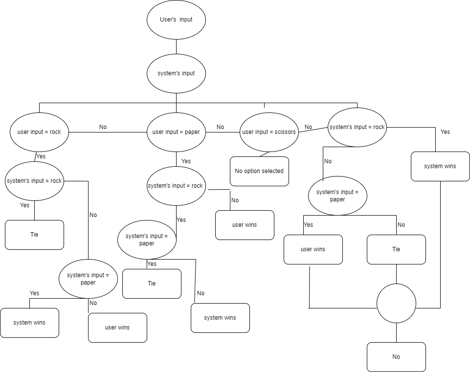

# Group-Lab

## Table of contents
1. [Game Plan](#Game Plan)
2. [Game Explanation](#Game Explanation)
3. [Role Description](#Role Description)
4. [Flowchart Explanation](#Flowchart Explanation)
 ##

### Game Plan
The game can include 2 players and has 3 symbols in total to present: ]
 
 i.    Rock     -->     Is superior to scissors
 ii.   Paper    -->     Is superior to rock
 iii.  Scissors -->     Is superior to paper  

### Game Explanation
Players can count till 3 and show either rock, paper or scissors at the same time, and depending on what symbol the have presented, the winner of the game is decided. 
From both the symbols presented, the symbol which is more superior is declared the winner of the round.  
The outcome of the game can also be a tie, if same symbols are presented by both the players.  

### Role Description
Project Manager: **_Tirth Chiragbhai Jayswal_**  
Release co-ordinator: **_Pritesh Sumanbhai Chaudhari_**  
Developer: **_Tirthkumar Jatinbhai Patel_**  
QA tester:  **_Rachit Garg_**  

### Flowchart Explanation
 
 ##
